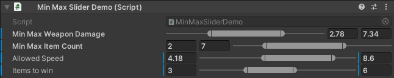
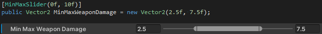
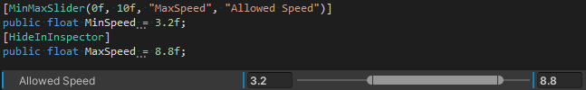

# MinMaxSlider


This Package contains a simple to use MinMaxSlider that can be drawn in custom editors or with a simple to use Attribute. Get started within seconds and configure your ranged values nicely and error safe.
 - Works with prefabs and overriden properties
 - Reposition and hide fields
 - Support for lots of types
 - Easy to use attribute
 - Use in custom inspector with editor code

## Supported Types
 - Vector2
 - Vector2Int
 - Float
 - Double
 - Integer
 - Long

## How to use: Attribute
Use this namespace to use the attribute:
```CSharp
using DaleOfWinter.Tools;
```

### Vector2, Vector2Int
You can use it with Vector2 and Vector2Int and it will be decorated accordingly.



### Float, Double, Integer, Long
With other primitive types you have to supply the max variable name. For an even nicer look hide the max variable field.



## How to use: Custom Editor
Use this namespace to use the editor code:
```CSharp
using DaleOfWinter.Tools.Editor;
```
All the Editor Code you need is in **DOWEditorGUI** and can be called like this:
```CSharp
DOWEditorGUI.MinMaxSlider(position, EditorGUIUtility.TrTempContent("My Slider"), myVector, 0f, 1f, SliderFieldPosition.Left, SliderFieldPosition.Right);
```
